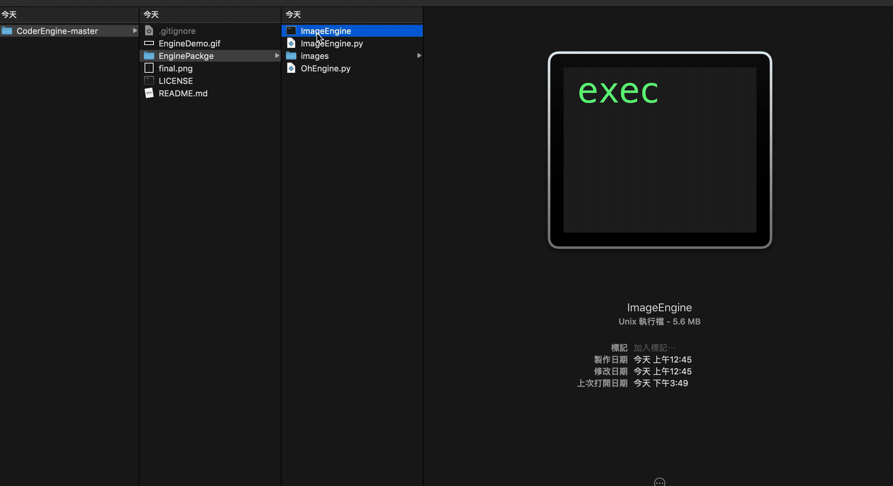
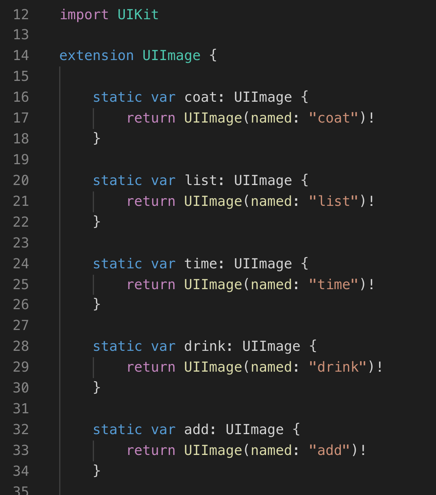

# CoderEngine

##Usage




you can run with

```shell
$ python3 ImageEngine.py
```

or

> Click ImageEngine.exec


And Then, ImageEngine will creat a `ImageHelper.switf` in desktop. like this 👇




### Enjoy it!


***


[My website](https://www.ohlulu.tw)

